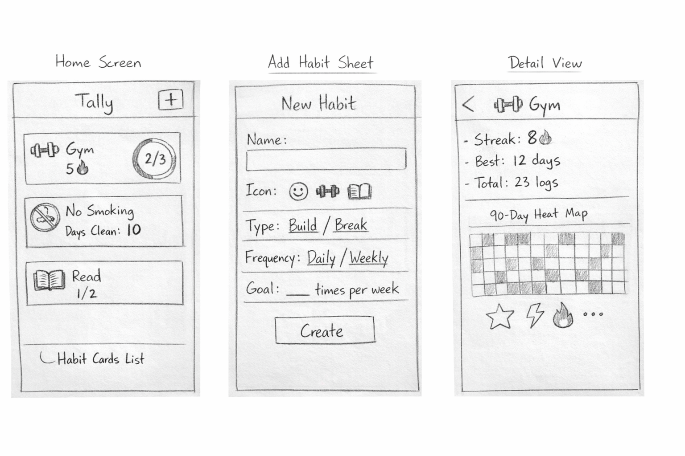

# Tally — iOS Habit Tracker

## Table of Contents
1. [Overview](#overview)
2. [Product Spec](#product-spec)
3. [Wireframes](#wireframes)
4. [Schema](#schema)

---

## Overview

### Description

Tally is an iOS habit tracker designed to make logging habits feel entertaining and addictive. Users track **positive habits** they want to build (e.g., gym visits, reading) and **negative habits** they want to break (e.g., alcohol, smoking). The app uses streaks, milestone celebrations, and satisfying animations to keep users engaged and motivated.

### App Evaluation

| Attribute | Assessment |
|-----------|-----------|
| **Category** | Health & Fitness / Productivity |
| **Mobile** | Mobile-first (iOS only). The core interaction — tapping to log a habit — is inherently a quick, one-handed mobile action. A desktop version would lose the immediacy that makes the app compelling. |
| **Story** | Tally tells the story of small daily actions compounding into lasting change. Every tap builds (or breaks) a streak, and every milestone is a moment worth celebrating. The emotional backbone is the streak — losing one feels real, extending one feels earned. |
| **Market** | General public, ages 16+. Anyone who wants a lightweight, visually rewarding accountability tool without the complexity of a full life-management app. Especially well-suited for people who have tried habit trackers before and found them boring or overwhelming. |
| **Habit** | Daily use. The home screen is designed for a fast daily check-in — users open the app, tap their completed habits, and close it. The idle pulse animation on unlogged habits actively draws users back. |
| **Scope** | Narrow and focused. MVP deliberately excludes notifications, social features, cloud sync, and widgets. The scope is: add habits → log daily → see streaks → enjoy feedback. |

---

## Product Spec

### 1. User Stories

#### Required Must-Have Stories

- [x] User can create a new habit with a name, emoji icon, type (Build or Break), and frequency goal
- [x] User can view all active habits on a home screen as a scrollable list of cards
- [x] User can tap a Build habit card to log one completion, with a progress ring showing progress toward the goal
- [x] User can view a Break habit's current streak (days of abstinence) and reset it via a confirmation dialog
- [ ] User can see streaks increment automatically and receive a celebration animation when hitting a milestone (3, 7, 14, 30, 100 days)
- [x] User can undo a log within 5 seconds via an inline toast
- [ ] User can open a habit's detail view showing current streak, best streak, total completions, and a 90-day heat map
- [x] User's data persists locally across app launches using SwiftData

#### Optional Nice-to-Have Stories

- [ ] User can edit or archive an existing habit
- [x] User can reorder habits via drag-and-drop on the main screen
- [ ] User can receive push notifications as daily reminders
- [ ] User can share their streak milestones to social media
- [ ] User can view a widget on their home screen showing today's habits
- [ ] User can sync data across devices via iCloud
- [ ] User can switch between dark and light mode

---

### 2. Screen Archetypes

**Home Screen**
- User can view all active habits as a scrollable list of cards
- User can tap a habit card to log a completion (Build) or see streak count (Break)
- User can tap "+" to open the habit creation sheet
- User can tap a habit card to navigate to the detail view

**Add Habit Sheet** (modal)
- User can enter a habit name
- User can pick an emoji icon
- User can toggle between Build and Break habit types
- User can set a frequency goal (daily or X times per week)
- User can pick an accent color

**Habit Detail View**
- User can view current streak, best streak, and total completions
- User can see a 90-day calendar heat map of their activity
- User can see earned milestone badges in a horizontal row

**Milestone Overlay** (full-screen modal)
- User sees a celebration animation when hitting a streak milestone
- User can dismiss the overlay by tapping or waiting 3 seconds

---

### 3. Navigation

#### Tab Navigation
*Tally is a single-screen app for MVP — no tab bar.*

#### Flow Navigation (Screen to Screen)

**Home Screen**
- Tapping "+" → **Add Habit Sheet** (modal slide-up)
- Tapping a habit card → **Habit Detail View** (push navigation)
- Hitting a milestone after logging → **Milestone Overlay** (full-screen overlay)

**Add Habit Sheet**
- Tapping "Create" → dismisses sheet → returns to **Home Screen** with new habit card

**Habit Detail View**
- Tapping back → returns to **Home Screen**

**Milestone Overlay**
- Tapping anywhere or 3-second timeout → dismisses → returns to **Home Screen**

---

## Wireframes

### [BONUS] Digital Wireframes & Mockups

> *To be added — Figma or Sketch mockups.*

### [BONUS] Interactive Prototype

> *To be added — Figma prototype link.*

---

## Schema

### Models

#### Habit

| Property | Type | Description |
|----------|------|-------------|
| `id` | `UUID` | Unique identifier for the habit |
| `name` | `String` | Display name (e.g., "Go to the Gym") |
| `emoji` | `String` | Single emoji icon selected by the user |
| `type` | `HabitType` | `.build` or `.break` |
| `frequencyGoal` | `Int` | Target completions per period (e.g., 2) |
| `frequencyPeriod` | `Period` | `.daily` or `.weekly` |
| `accentColor` | `String` | Hex color code for the card's accent |
| `sortOrder` | `Int` | User-defined display order |
| `isArchived` | `Bool` | Hidden from home view when true |
| `createdAt` | `Date` | Timestamp of habit creation |
| `logs` | `[HabitLog]` | Cascade-deleted relationship to log entries |

#### HabitLog

| Property | Type | Description |
|----------|------|-------------|
| `id` | `UUID` | Unique identifier for the log entry |
| `date` | `Date` | Calendar day (time stripped to midnight) |
| `completionCount` | `Int` | Number of times logged on this date (Build habits) |
| `didSlip` | `Bool` | `true` if the user reset their streak (Break habits) |
| `habit` | `Habit?` | Parent habit reference |

#### MilestoneDefinition (value type, not persisted)

| Property | Type | Description |
|----------|------|-------------|
| `name` | `String` | Display name (e.g., "Spark", "Fire") |
| `threshold` | `Int` | Streak length required to earn (3, 7, 14, 30, 100) |
| `animationType` | `AnimationType` | Which celebration animation to play |

---

### Networking

Tally is fully **offline** for MVP — no network requests are made. All data is stored locally via SwiftData.

> If cloud sync is added in a future version, the following endpoints would apply:

| Screen | Request | Purpose |
|--------|---------|---------|
| App Launch | `[GET] /users/{id}/habits` | Fetch synced habits |
| Log Completion | `[POST] /habits/{id}/logs` | Sync a new log entry |
| Create Habit | `[POST] /habits` | Create habit in cloud |
| Archive Habit | `[PATCH] /habits/{id}` | Update archive status |

---

## Build Progress

### Sprint 1 — Completed Items

**Member A — Data Layer & Business Logic** ✅
- [x] `Habit` and `HabitLog` SwiftData models with all properties (A1, A2)
- [x] `HabitType` and `Period` enums — `.build`/`.break`, `.daily`/`.weekly` (A1)
- [x] `StreakEngine` — current streak, best streak, completions in period, goal-met check for Build/daily, Build/weekly, and Break habits (A3, A4)
- [x] Unit tests for `StreakEngine` — 17 test cases covering daily build, weekly build, break, gaps, edge cases (A5)
- [x] `DateHelpers` utility — start of day, start of week, date ranges, day/week comparisons (A6)

**Member B — Home Screen & Daily Logging** ✅
- [x] `HomeViewModel` — fetch habits, handle logging, undo with 5s timer, drag-to-reorder (B1)
- [x] `HomeView` — scrollable list of habit cards with empty state onboarding message (B2)
- [x] `HabitCardView` — emoji, name, streak count, tap-to-log with spring bounce animation and idle pulse (B3, B7, B9)
- [x] `ProgressRingView` — animated circular arc with trim + easeOut fill animation and glow at 100% (B4, B8)
- [x] `StreakCounterView` — prominent day counter + "I slipped" button with confirmation dialog (B5)
- [x] `UndoToastView` — 5-second undo window with slide-up toast (B6)
- [x] `HapticManager` — light, medium, heavy, doubleTap, and success haptic patterns (B10)
- [x] `Color+Hex` — hex color string to SwiftUI Color extension

**Project Setup** ✅
- [x] Xcode project created (iOS 17+, SwiftUI lifecycle)
- [x] Folder structure initialized per TRD spec
- [x] Git repository set up with feature branch strategy
- [x] SwiftData `ModelContainer` added to `TallyApp.swift`
- [x] App icon designed and added (target/crosshair in indigo on dark background)

### Sprint 1 — Demo GIFs/Videos

> 📹 *Video walkthroughs and GIFs to be recorded and added below.*

| Feature | Preview |
|---------|---------|
| Home screen with habit cards | *(GIF to be added)* |
| Logging a Build habit (tap + progress ring) | *(GIF to be added)* |
| Break habit streak + "I slipped" reset | *(GIF to be added)* |
| Undo toast in action | *(GIF to be added)* |
| Drag-to-reorder habits | *(GIF to be added)* |
| Empty state onboarding | *(GIF to be added)* |

---

### Sprint 2 — Planned Issues (Next Unit)

| Issue # | Task | Assignee | Priority | Milestone |
|---------|------|----------|----------|-----------|
| [#1](https://github.com/Kazemanezak/Tally/issues/1) | Build `AddHabitSheet` — habit creation form | @kylequesadaa | High | Phase 1 |
| [#2](https://github.com/Kazemanezak/Tally/issues/2) | Build `HabitDetailViewModel` — stats calculations | @kylequesadaa | High | Phase 1 |
| [#3](https://github.com/Kazemanezak/Tally/issues/3) | Build `HabitDetailView` — stats and detail layout | @kylequesadaa | High | Phase 1 |
| [#4](https://github.com/Kazemanezak/Tally/issues/4) | Build `CalendarHeatMapView` — 90-day activity grid | @kylequesadaa | High | Phase 1 |
| [#5](https://github.com/Kazemanezak/Tally/issues/5) | Build `MilestoneBadgeRow` — earned milestone badges | @kylequesadaa | Medium | Phase 1 |
| [#6](https://github.com/Kazemanezak/Tally/issues/6) | Build `MilestoneService` — milestone detection logic | @Kazemanezak | High | Phase 2 |
| [#7](https://github.com/Kazemanezak/Tally/issues/7) | Write unit tests for `MilestoneService` | @Kazemanezak | High | Phase 2 |
| [#8](https://github.com/Kazemanezak/Tally/issues/8) | Build `MilestoneOverlay` — celebration overlay view | @Kazemanezak | High | Phase 2 |
| [#9](https://github.com/Kazemanezak/Tally/issues/9) | Integrate haptics into milestones | @grazuri95 | Medium | Phase 2 |
| [#10](https://github.com/Kazemanezak/Tally/issues/10) | `ParticleBurstView` — Spark animation | @kylequesadaa | Medium | Phase 2 |
| [#11](https://github.com/Kazemanezak/Tally/issues/11) | `FlameAnimationView` — Fire animation | @kylequesadaa | Medium | Phase 2 |
| [#12](https://github.com/Kazemanezak/Tally/issues/12) | `LightningEffectView` — Lightning animation | @kylequesadaa | Medium | Phase 2 |
| [#13](https://github.com/Kazemanezak/Tally/issues/13) | `SupernovaView` — Supernova animation | @kylequesadaa | Medium | Phase 2 |
| [#14](https://github.com/Kazemanezak/Tally/issues/14) | Edit habit flow | @Kazemanezak | Medium | Phase 3 |
| [#15](https://github.com/Kazemanezak/Tally/issues/15) | Archive/unarchive habits | @Kazemanezak | Medium | Phase 3 |
| [#16](https://github.com/Kazemanezak/Tally/issues/16) | Timezone & multi-day gap edge cases | @Kazemanezak | Medium | Phase 3 |
| [#17](https://github.com/Kazemanezak/Tally/issues/17) | Navigation polish (all habit types) | @grazuri95 | Medium | Phase 3 |
| [#18](https://github.com/Kazemanezak/Tally/issues/18) | Dark theme polish | @grazuri95 | Low | Phase 3 |
| [#19](https://github.com/Kazemanezak/Tally/issues/19) | Legend badge animation (100-day) | @kylequesadaa | Low | Phase 3 |
| [#20](https://github.com/Kazemanezak/Tally/issues/20) | Seed demo data | @kylequesadaa | Low | Phase 3 |
| [#21](https://github.com/Kazemanezak/Tally/issues/21) | Full user flow walkthrough | Team | High | Phase 4 |
| [#22](https://github.com/Kazemanezak/Tally/issues/22) | Physical device testing | Team | High | Phase 4 |
| [#23](https://github.com/Kazemanezak/Tally/issues/23) | Fix integration bugs | Team | High | Phase 4 |
| [#24](https://github.com/Kazemanezak/Tally/issues/24) | Rehearse demo | Team | Medium | Phase 4 |

---

## Milestone Summary

### Unit 8 — Group Milestone 2

| Deliverable | Status |
|-------------|--------|
| GitHub Project Board created | ✅ |
| GitHub Milestones created (Phase 1–4) | ✅ |
| GitHub Issues created from user features (24 issues) | ✅ |
| Issues added to project and assigned to team members | ✅ |
| Sprint 1 issues updated in project board | ✅ |
| Sprint 2 issues created, assigned & added to board | ✅ |
| Completed user stories checked off in README | ✅ |
| Build progress videos/GIFs added to README | ⏳ *(to be recorded)* |
